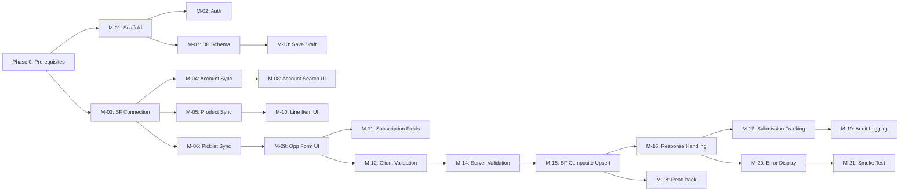

# MVP Backlog & Delivery Plan

> **Version:** 0.1-draft  
> **Date:** 2026-03-02

---

## Phase Overview

| Phase             | Scope                                                | Goal                          | Duration (est.) |
| ----------------- | ---------------------------------------------------- | ----------------------------- | --------------- |
| **Phase 0**       | Metadata completion + SF prerequisites               | Unblock MVP build             | 1-2 days        |
| **Phase 1 — MVP** | Core portal: create software subscription Opp + OLIs | First working end-to-end flow | 2-3 weeks       |
| **Phase 2**       | Polish, edit/retry, audit UI, admin features         | Production-ready              | 2-3 weeks       |
| **Phase 3**       | Advanced features, reporting, approvals              | Full capability               | 3-4 weeks       |

---

## Phase 0 — Prerequisites (Before Coding)

> These must be completed before MVP development starts.

| #     | Task                                       | Owner               | Status | Detail                                                                                                                                                                    |
| ----- | ------------------------------------------ | ------------------- | ------ | ------------------------------------------------------------------------------------------------------------------------------------------------------------------------- |
| P0-01 | Retrieve Opportunity field describe        | Dev                 | ❌     | Run `sf sobject describe Opportunity --json` and extract custom fields, types, picklist values, required flags                                                            |
| P0-02 | Retrieve OLI field describe                | Dev                 | ❌     | Same for OpportunityLineItem                                                                                                                                              |
| P0-03 | Retrieve Opportunity Record Types          | Dev                 | ❌     | `SELECT Id, Name, DeveloperName FROM RecordType WHERE SObjectType = 'Opportunity' AND IsActive = true`                                                                    |
| P0-04 | Retrieve Validation Rules                  | Dev                 | ❌     | `sf project retrieve start --metadata "ValidationRule:Opportunity.*"`                                                                                                     |
| P0-05 | Confirm subscription fields exist on OLI   | Dev + SF Admin      | ❌     | Do `Subscription_Start_Date__c`, `Subscription_Term__c`, `Subscription_Billing_Commitment__c`, `Subscription_Billing_Plan__c`, `Contract_Type__c`, `Sales_Cost__c` exist? |
| P0-06 | Create External ID fields                  | SF Admin            | ❌     | Create `Portal_Deal_Id__c` on Opportunity and `Portal_Line_Id__c` on OpportunityLineItem (Text 36, Unique, External ID)                                                   |
| P0-07 | Create Connected App                       | SF Admin            | ❌     | OAuth 2.0 JWT Bearer flow, scoped permissions, certificate upload                                                                                                         |
| P0-08 | Confirm portal LOB value                   | Business            | ❌     | What is the exact `Lines_Of_Business__c` picklist value for software subscriptions?                                                                                       |
| P0-09 | Confirm initial Stage value                | Business            | ❌     | What stage should portal-created Opps start at?                                                                                                                           |
| P0-10 | Confirm active Pricebook                   | Business / SF Admin | ❌     | Which Pricebook2 is used for software subscription products?                                                                                                              |
| P0-11 | Set up Microsoft Entra ID App Registration | IT / Admin          | ❌     | For SSO authentication                                                                                                                                                    |

---

## Phase 1 — MVP (Weeks 1-3)

> **Goal:** A salesperson can log in, find an account, create a software subscription Opportunity with line items, and submit it to Salesforce.

### Sprint 1 (Week 1): Foundation

| #    | Story                                                                                                                                                         | Priority | Estimate |
| ---- | ------------------------------------------------------------------------------------------------------------------------------------------------------------- | -------- | -------- |
| M-01 | **Project scaffold** — Set up Next.js frontend + Express API + TypeScript + PostgreSQL schema + dev environment                                               | P0       | 1d       |
| M-02 | **Auth — SSO login** — Integrate Microsoft Entra ID OIDC; issue portal JWT; protect API routes                                                                | P0       | 1d       |
| M-03 | **SF connection service** — jsforce client with JWT Bearer auth; token refresh; connection pooling                                                            | P0       | 0.5d     |
| M-04 | **Account sync** — Nightly SOQL sync of active customer accounts into portal DB; search endpoint                                                              | P0       | 0.5d     |
| M-05 | **Product/Pricebook sync** — Nightly sync of active products + pricebook entries into portal DB                                                               | P0       | 0.5d     |
| M-06 | **Picklist sync** — SF Describe API → cache picklist values for Opportunity + OLI fields                                                                      | P0       | 0.5d     |
| M-07 | **Portal DB schema** — Create tables: account_ref, product_ref, pricebook_entry_ref, picklist_values, deal, deal_line_item, submission, sync_job, audit_event | P0       | 0.5d     |

### Sprint 2 (Week 2): Deal Creation Form

| #    | Story                                                                                                                                                                     | Priority | Estimate |
| ---- | ------------------------------------------------------------------------------------------------------------------------------------------------------------------------- | -------- | -------- |
| M-08 | **Account search UI** — Typeahead search across cached accounts; show name, number, city                                                                                  | P0       | 0.5d     |
| M-09 | **Opportunity form UI** — Form with fields: Stage, Close Date, LOB, Funding Type, Currency, SO Type, SO Required, Deliver To, Customer PO. Picklist dropdowns from cache. | P0       | 1d       |
| M-10 | **Line item form UI** — Add/remove product lines. Product picker, quantity, unit price (defaults from pricebook), product condition, discount.                            | P0       | 1.5d     |
| M-11 | **Subscription fields UI** — Conditional fields when Funding Type = Subscription: start date, term, billing commitment, billing plan                                      | P0       | 0.5d     |
| M-12 | **Client-side validation** — Implement all V-OPP-_ and V-OLI-_ rules with inline errors                                                                                   | P0       | 0.5d     |
| M-13 | **Save draft** — POST/PUT /api/deals to save deal + line items in portal DB without SF push                                                                               | P1       | 0.5d     |

### Sprint 3 (Week 3): Submit to Salesforce

| #    | Story                                                                                                   | Priority | Estimate |
| ---- | ------------------------------------------------------------------------------------------------------- | -------- | -------- |
| M-14 | **Server-side validation** — Re-validate all rules on the API layer before SF push                      | P0       | 0.5d     |
| M-15 | **SF Composite upsert** — Build Composite API request; map portal fields → SF fields; execute upsert    | P0       | 1.5d     |
| M-16 | **SF response handling** — Parse success (store SF IDs) and error (map field errors to portal fields)   | P0       | 0.5d     |
| M-17 | **Submission tracking** — Update submission status; store SF Opp ID + URL; show success/failure in UI   | P0       | 0.5d     |
| M-18 | **Read-back** — After successful submit, fetch auto-generated Opportunity Name from SF; display to user | P1       | 0.5d     |
| M-19 | **Audit logging** — Log every create/submit action with user, timestamp, payload                        | P0       | 0.5d     |
| M-20 | **Basic error display** — Show SF validation errors in the form with field highlighting                 | P0       | 0.5d     |
| M-21 | **MVP smoke test** — End-to-end: login → select account → fill form → add lines → submit → verify in SF | P0       | 0.5d     |

### MVP Definition of Done

- [ ] User can log in via SSO
- [ ] User can search and select an account
- [ ] User can fill out Opportunity header with all required fields
- [ ] User can add 1+ software product line items
- [ ] Subscription-specific fields appear conditionally
- [ ] Client-side validation catches errors before submit
- [ ] Submit pushes data to Salesforce via Composite API
- [ ] Salesforce Opportunity + OLIs are created correctly
- [ ] SF Opportunity_Naming_Convention flow runs and generates correct name
- [ ] Portal receives and displays SF Opportunity ID + link
- [ ] Submission is logged in portal DB with audit trail
- [ ] Retry on 5xx / timeout works without duplicating records (idempotent)

---

## Phase 2 — Production Ready (Weeks 4-6)

| #     | Story                                                                                                                     | Priority | Estimate |
| ----- | ------------------------------------------------------------------------------------------------------------------------- | -------- | -------- |
| P2-01 | **Retry queue** — pg-boss job queue for failed submissions; exponential backoff (1m → 5m → 15m → 30m → 60m)               | P0       | 1d       |
| P2-02 | **Dead letter queue** — After 5 failed retries, move to dead letter; alert admin                                          | P0       | 0.5d     |
| P2-03 | **Edit existing deal** — Load a saved/failed deal; modify fields; re-submit                                               | P1       | 1d       |
| P2-04 | **Deals dashboard** — List of user's deals with status badges (draft / pending / synced / failed / dead)                  | P1       | 1d       |
| P2-05 | **Submission detail view** — Show full timeline: created → submitted → synced/failed → retried                            | P1       | 0.5d     |
| P2-06 | **Admin: all submissions** — Admin view of all users' submissions; filter by status, user, date                           | P2       | 0.5d     |
| P2-07 | **Admin: manual retry** — Admin can trigger retry of any failed submission                                                | P2       | 0.5d     |
| P2-08 | **Portal design & branding** — Xeretec brand styling: dark theme, red accents, professional typography, responsive layout | P1       | 1.5d     |
| P2-09 | **Toasts & notifications** — Success/error/info toast notifications; loading states; skeleton screens                     | P1       | 0.5d     |
| P2-10 | **Environment config** — Env vars management; Azure Key Vault integration; deployment config                              | P0       | 0.5d     |
| P2-11 | **CI/CD pipeline** — GitHub Actions: lint, test, build, deploy to staging                                                 | P1       | 0.5d     |
| P2-12 | **Security hardening** — Rate limiting, CORS, CSP headers, input sanitization, SQL injection prevention                   | P0       | 0.5d     |
| P2-13 | **Integration tests** — Test SF composite upsert with sandbox; test idempotent retry                                      | P0       | 1d       |
| P2-14 | **User acceptance testing** — Structured UAT with 2-3 salespeople using sandbox                                           | P0       | 1d       |

---

## Phase 3 — Advanced Features (Weeks 7-10)

| #     | Story                                                                                                                  | Priority | Estimate |
| ----- | ---------------------------------------------------------------------------------------------------------------------- | -------- | -------- |
| P3-01 | **Product hierarchy support** — Parent/accessory/managed service grouping (mirror SF Product_Groups\_\_c)              | P2       | 1.5d     |
| P3-02 | **Margin calculator** — Live margin % display (UnitPrice vs Sales_Cost)                                                | P2       | 0.5d     |
| P3-03 | **Document upload** — Attach supporting documents to deal (stored in portal + optionally pushed to SF ContentDocument) | P3       | 1.5d     |
| P3-04 | **Approval workflow status** — Show Compliance/Technical approval status from SF in portal                             | P2       | 1d       |
| P3-05 | **Reporting — Track 1** — Contract wins count, potential annual revenue, potential annual GP                           | P1       | 1.5d     |
| P3-06 | **Reporting — Track 2** — Realised monthly GP dashboard (reads from invoice data)                                      | P1       | 2d       |
| P3-07 | **Track 1 vs Track 2 separation** — Visual separation; no mixing of subscription contract value into monthly GP        | P0       | 0.5d     |
| P3-08 | **Deal cloning** — Clone an existing deal as a template for similar subscriptions                                      | P3       | 0.5d     |
| P3-09 | **Bulk product add** — CSV import of line items for large deals                                                        | P3       | 1d       |
| P3-10 | **Notification system** — Email/in-app notifications for sync failures, approval outcomes                              | P2       | 1d       |
| P3-11 | **Audit log viewer** — Admin UI to browse audit events with filtering                                                  | P2       | 1d       |
| P3-12 | **Multi-deal submission** — Submit multiple deals in batch                                                             | P3       | 1d       |

---

## Risk Register

| #    | Risk                                                                    | Impact                           | Likelihood | Mitigation                                                              |
| ---- | ----------------------------------------------------------------------- | -------------------------------- | ---------- | ----------------------------------------------------------------------- |
| R-01 | Subscription fields don't exist on OLI                                  | High — can't store required data | Medium     | Phase 0 verification; create fields if missing                          |
| R-02 | SF validation rules reject portal submissions unexpectedly              | Medium — user confusion          | High       | Retrieve and replicate all VRs in portal; good error parsing            |
| R-03 | Existing SF automation interferes with portal-created data              | High — data corruption           | Low        | Thorough flow analysis already done; avoid Closed Won on initial submit |
| R-04 | Connected App permissions too restrictive                               | Medium — API errors              | Low        | Test against sandbox before production; iterate quickly                 |
| R-05 | Multi-currency PricebookEntry matching fails                            | Medium — wrong prices            | Medium     | Currency validation in portal; ensure PBE query matches currency        |
| R-06 | DLRS rollup triggers cause governor limit issues                        | Low — performance                | Low        | DLRS is well-tested; monitor during UAT                                 |
| R-07 | Opportunity Naming Convention counter collides under concurrent creates | Low — duplicate names            | Low        | SF handles this; portal creates sequentially per user                   |

---

## Dependencies

---

## Success Metrics

| Metric                                                | MVP Target     | Phase 2 Target           |
| ----------------------------------------------------- | -------------- | ------------------------ |
| Submit → SF sync success rate                         | > 90%          | > 99%                    |
| Time from form fill to SF record created              | < 10 seconds   | < 5 seconds              |
| Retry success rate (after transient failure)          | > 80%          | > 95%                    |
| User adoption (salespeople using portal vs direct SF) | 3+ pilot users | Full software sales team |
| Zero duplicate Opportunities from portal retries      | 0 duplicates   | 0 duplicates             |
